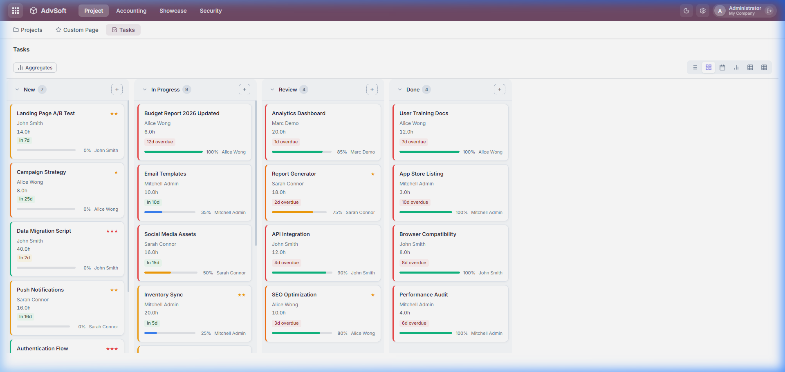
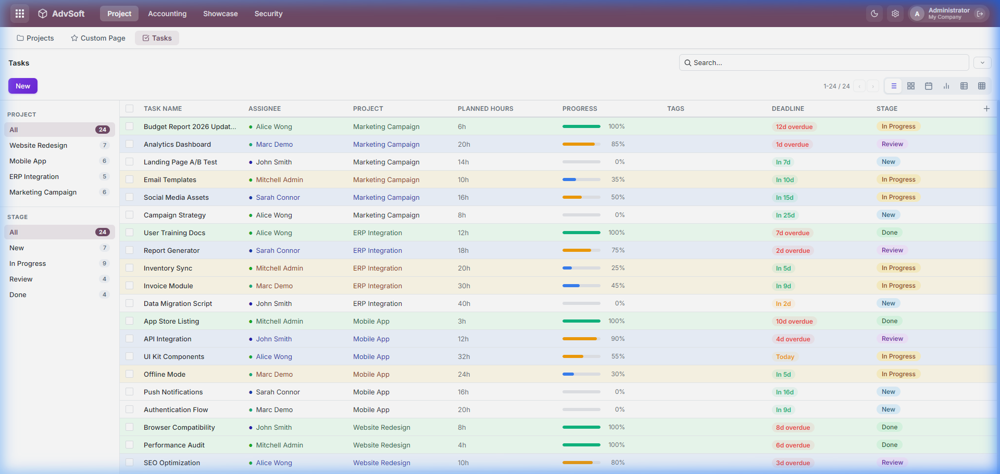
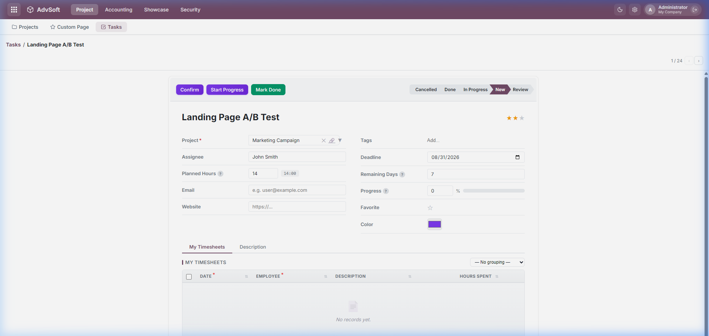
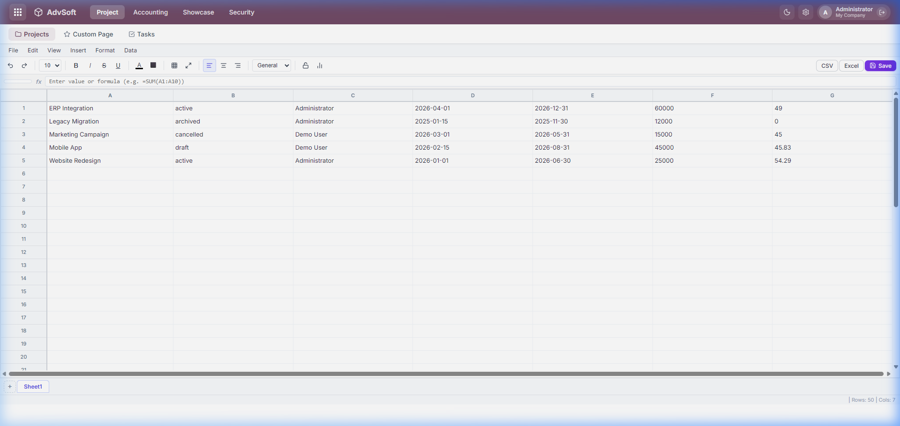

# AdvSoft

<p align="center">
  <strong>Metadata-Driven Enterprise Business Application Platform</strong><br>
  <em>Built on pure Adianti PHP Framework Backend & modern OWL 2.0 SPA Web Client</em>
</p>

<p align="center">
  
  
  
  
  
</p>

<p align="center">
  <a href="#english">English</a> •
  <a href="#português">Português</a> •
  <a href="TUTORIAL.md"><strong>Complete Tutorial (Zero to Hero)</strong></a>
</p>

---

## 📸 Screenshots Showcase

<p align="center">
  
  <br><em>Interactive Drag-and-Drop Kanban View with Stage Management, Tags, Priority Stars, and Progress Bars</em>
</p>

<table width="100%">
  <tr>
    <td width="50%" align="center">
      
      <br><strong>Responsive List Grid View</strong><br>
      <em>Dynamic column aggregates (Sum, Avg), badges & row styling</em>
    </td>
    <td width="50%" align="center">
      
      <br><strong>Document Form View</strong><br>
      <em>Interactive statusbar, 2-column layout & One2Many tabs</em>
    </td>
  </tr>
  <tr>
    <td colspan="2" align="center">
      
      <br><strong>Collaborative Spreadsheet Engine</strong><br>
      <em>Embedded spreadsheet grid for bulk data entry, formula calculation, and live reporting</em>
    </td>
  </tr>
</table>

---

<a name="english"></a>
## 🇬🇧 English

> **AdvSoft** is a modern, metadata-driven business application platform inspired by Odoo architecture, developed on top of the **Adianti PHP Framework** backend and the high-performance **OWL 2.0 (Odoo Web Library)** frontend SPA.

### 🚀 Key Features

- **Metadata-Driven ORM & Registry**: Dynamic model definitions, relational fields (`many2one`, `one2many`, `many2many`), computed fields (`@api.depends`), constraints (`@api.constrains`), and domain filter expressions.
- **OWL 2.0 Multi-View UI**: Interactive web client featuring Form, List, Kanban, Calendar, Graph, Pivot, and Spreadsheet views.
- **Pure Adianti Framework Engine**: Built strictly on native PHP and Adianti architecture (`lib/adianti`, `app/config`, `app/control`, `app/model`, `app/Advsoft`, `init.php`).
- **6-Layer Security Architecture**: Granular access control lists (ACLs via `ir.model.access`), record rules (`ir.rule` with dynamic domain tokens), group hierarchies, and sudo/super-user execution contexts.
- **Modular Addons**: Native business modules (`base`, `project`, `account`, `showcase`, `spreadsheet`) with automated discovery.
- **Financial & Accounting Suite**: Complete double-entry accounting with Trial Balance, General Ledger, Balance Sheet, and Income Statements.
- **Visual Customization Tools**: Built-in visual View Builder and drag-and-drop Menu Editor.
- **QWeb Reporting Engine**: Embedded QWeb XML template rendering with PDF generation via Dompdf and HTML live preview.
- **Collaborative Spreadsheet**: Embedded spreadsheet engine with live formula calculations, pivot integration, and multi-user presence.

---

### 📦 Quick Start

#### 1. Prerequisites
- **PHP** >= 8.1 (Extensions: `pdo_mysql` or `pdo_sqlite`, `mbstring`, `json`, `openssl`)
- **MySQL 5.7+ / 8.0+** or **SQLite 3**
- **Composer**

#### 2. Setup & Database Installation

```bash
# Clone the repository
git clone https://github.com/taufikinfo/AdvSoft.git
cd AdvSoft

# Install PHP dependencies
composer install

# Option A: MySQL (Production / Standard)
mysql -u root -p -e "CREATE DATABASE advsoft CHARACTER SET utf8mb4 COLLATE utf8mb4_unicode_ci;"
mysql -u root -p advsoft < app/database/advsoft.sql

# Option B: SQLite (Local Dev)
# Already pre-configured at database/database.sqlite
```

#### 3. Run Test Suite
```bash
php test_api.php
```

#### 4. Start Local Development Server
```bash
php -S 127.0.0.1:8000 index.php
```
Open your browser at: **[http://127.0.0.1:8000](http://127.0.0.1:8000)**

---

### 🔑 Default Credentials

| Role | Username | Password |
|---|---|---|
| **System Administrator** | `admin` | `admin` |
| **Demo User** | `demo` | `demo` |

---

### 📁 Directory Structure

```
AdvSoft/
├── app/
│   ├── Advsoft/             # Core Engine (Registry, ModelDefinition, Field, Security, QWeb)
│   ├── config/              # Database & Application Configs (advsoft.ini, application.php)
│   ├── control/             # Addons & Controllers (app/control/Controllers/, project, account)
│   ├── database/            # Database assets (database.sqlite, migrations/, seeders/, advsoft.sql)
│   ├── model/               # Active Record Models (BaseModel, Account, Project, Res, Ir)
│   └── resources/           # Blade views, templates, and UI assets (views, css, js)
├── docs/
│   └── screenshots/         # Application visual documentation
├── lib/
│   └── adianti/             # Adianti PHP Framework Core Library
├── public/
│   ├── css/                 # Modern stylesheets (adianti-design-system.css, app.bundle.css)
│   └── js/                  # OWL 2.0 Web Client (Core, Widgets, Views, Pages)
├── routes/
│   └── web.php              # Route definitions & API endpoints
├── TUTORIAL.md              # 📖 Complete Developer Tutorial (From Zero to Hero)
├── index.php                # Front Controller & Application Gateway
├── init.php                 # Adianti Autoloader & Bootstrap
├── compile_assets.php       # Asset bundle compiler (production mode)
└── composer.json            # Dependencies & PSR-4 Autoload configuration
```

---

<a name="português"></a>
## 🇵🇹 Português

> **AdvSoft** é uma plataforma de aplicativos empresariais orientada a metadados (*metadata-driven*), inspirada na arquitetura Odoo, construída com backend sobre o **Adianti PHP Framework** e frontend moderno em **OWL 2.0 (Odoo Web Library)**.

### 🚀 Recursos Principais

- **ORM Orientado a Metadados & Registry**: Definições dinâmicas de modelos, relacionamentos (`many2one`, `one2many`, `many2many`), campos computados (`@api.depends`), validações (`@api.constrains`) e filtros de domínio.
- **Interface Rica com OWL 2.0**: Cliente web SPA com suporte a múltiplas visualizações interativas: Formulário (Form), Lista (List), Kanban, Calendário (Calendar), Gráfico (Graph), Tabela Dinâmica (Pivot) e Planilha (Spreadsheet).
- **Estrutura Pura Adianti Framework**: Desenvolvido em total conformidade com a convenção do Adianti Framework (`lib/adianti`, `app/config`, `app/control`, `app/model`, `app/Advsoft`, `init.php`).
- **Segurança em 6 Camadas**: Controle de acesso detalhado (ACLs via `ir.model.access`), regras de registro (`ir.rule`), hierarquia de grupos e contexto de superusuário (`sudo()`).
- **Sistema Modular de Addons**: Módulos empresariais integrados (`base`, `project`, `account`, `showcase`, `spreadsheet`) com descoberta automática.
- **Relatórios Contábeis & Financeiros**: Balancete de Verificação (Trial Balance), Livro Razão (General Ledger), Balanço Patrimonial (Balance Sheet) e DRE (Income Statement).
- **Motor de Relatórios QWeb**: Renderização de templates XML/QWeb com exportação para PDF via Dompdf e pré-visualização em HTML.
- **Planilhas Colaborativas Integradas**: Mecanismo de planilha eletrônica autônomo com fórmulas dinâmicas, tabelas dinâmicas e colaboração multiusuário.

---

### 📦 Instalação e Execução

#### 1. Pré-requisitos
- **PHP** >= 8.1 (Extensões: `pdo_mysql` ou `pdo_sqlite`, `mbstring`, `json`, `openssl`)
- **MySQL 5.7+** ou **SQLite 3**
- **Composer**

#### 2. Configuração e Banco de Dados

```bash
# Clonar o repositório
git clone https://github.com/taufikinfo/AdvSoft.git
cd AdvSoft

# Instalar dependências
composer install

# Opção MySQL:
mysql -u root -p -e "CREATE DATABASE advsoft CHARACTER SET utf8mb4 COLLATE utf8mb4_unicode_ci;"
mysql -u root -p advsoft < app/database/advsoft.sql
```

#### 3. Testes Automatizados
```bash
php test_api.php
```

#### 4. Iniciar o Servidor Local
```bash
php -S 127.0.0.1:8000 index.php
```
Acesse no seu navegador: **[http://127.0.0.1:8000](http://127.0.0.1:8000)**

---

### 🔑 Credenciais Padrão

| Perfil | Usuário | Senha |
|---|---|---|
| **Administrador do Sistema** | `admin` | `admin` |
| **Usuário de Demonstração** | `demo` | `demo` |

---

### 📚 Documentação e Tutorial Completo

Consulte o arquivo [**TUTORIAL.md**](TUTORIAL.md) para o guia detalhado *From Zero to Hero*, cobrindo:
- Criação de novos módulos e tabelas passo a passo
- Matriz completa de campos e widgets
- Configurações de visões List, Form, Kanban, Search, Graph e Spreadsheet
- Sistema de segurança, ACLs e regras de registro
- Lógica de negócios (`@api.depends`, `@api.constrains`, `@api.onchange`, Lifecycle Hooks)
- Motor de relatórios QWeb e impressão de documentos
- Dicas de implantação em produção (Nginx/Apache)

---

<p align="center">
  <sub>AdvSoft &copy; 2026. Powered by Adianti PHP Framework & OWL 2.0. MIT License.</sub>
</p>
